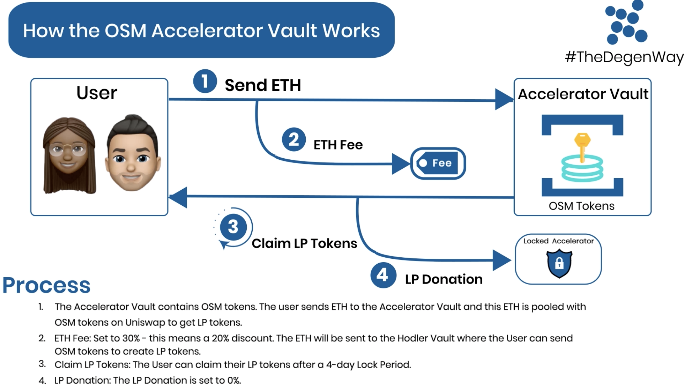
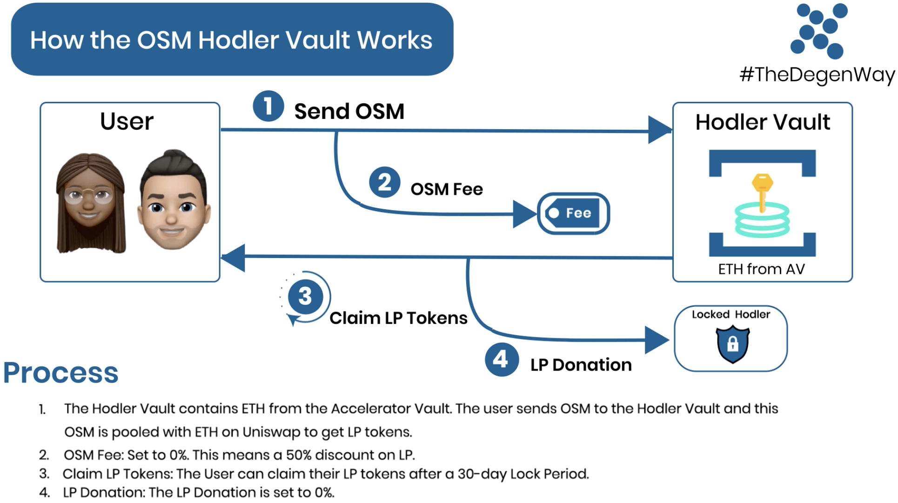

# 🌀 Accelerator Vault Explainer - Mainnet Version

### Introduction to Liquid Vault

We have covered the LiquidVault in these articles before, so we are going to leave the older versions in this folder. The DegenVC Liquid Vault (LV) technology is fully described in this [**Medium article**](https://medium.com/degen-vc/liquid-vault-248779b58cfe).

### ----------------------------------------------

## Introducing: The Accelerator Vault / Hodler Vault Combination for the $OSM Token &#x20;

We have taken the future-forward decision to launch not one Liquid Vault, but **2 Liquid Vaults for the $OSM Token**. This decision was a result of numerous community engagements and a lot of internal discussion about the rationale for the use of the Liquid Vault in the Options.Market project, and the desired outcomes of its use.

Once the idea formed that liquidity growth was essential to the long-term success of the project, the idea hatched for 2 Liquid Vaults - welcome to the Accelerator Vault / Hodler Vault Combination!

### 1. The Accelerator Vault

#### _**DISCOUNT ON ACCELERATOR VAULT: 20%**_

Liquid Vault 1 in our construct remains the AV. We use the 3 AV levers as follows:

1. The **ETH Fee charged will be 30%** - this means a 20% discount. Instead of buy pressure, the ETH collected from the ETH fee will be sent to the **Hodler Vault** where the User can send OSM tokens to create LP tokens (more on this below).\

2.  The LP tokens will be **locked for a period of 4-days** on the Web UI. Once this time is up, the user will be able to claim their LP from the Web UI and do with their LP what they want. They could:

    1. Unpool and sell the $OSM and keep the ETH, or reinvest it in the LP for another 20% discount;
    2. Retain the LP to add value to overall $OSM liquidity; or
    3. A combination of the above.&#x20;

    \
    _**In AV, this lock period remain static.**_\

3.  There will be a **0% LP Donation -** there is no permanent lock on LP tokens.\
    \
    _**In AV, no permanent lock period will be used.**_

### ----------------------------------------------

### 2. The Hodler Vault

#### _**DISCOUNT ON HODLER VAULT: 50% - YES, A FULL 50%!!**_

Liquid Vault 2 is brand new, even for the DegenVC team. In the Hodler Vault we have flipped the mechanism. Here the User sends OSM tokens to claim ETH that is the ETH Fee in the Accelerator Vault.&#x20;

A User will now send OSM to the Holder Vault **TO CLAIM ETH**! It's revolutionary. Here are the details:

1. The **ETH Fee is now the OSM Fee, and will be set to 0%.** \

2.  The LP tokens will be **locked for a period of 30-days** on the Web UI. Once this time is up, the user will be able to claim their LP from the Web UI and do with their LP what they want. They could:

    1. Unpool and sell the $OSM and keep the ETH, or reinvest it in the LP for another 50% discount;
    2. Retain the LP to add value to overall $OSM liquidity; or
    3. A combination of the above.&#x20;

    \
    _**In HV, this lock period remain static.**_\

3.  There will be a **0% LP Donation -** there is no permanent lock on LP tokens.\
    \
    _**In HV, no permanent lock period will be used.**_

### ----------------------------------------------

### Summary

This combination is designed to incentivise people to claim a discount potentially multiple times, while having their LP locked for differing period of time according to their discount preference. Alternatives, as they say, are everything in life!!

The AV will be seeded with 10% of total supply - 10MM tokens. It will then be up to users to decide if:

1. AV: The 20% discount is worth the short 4-day lock period. It will be a fascinating time.
2. HV: The 50% discount is sufficient to cover the 30-day lock period.&#x20;

It will be a fascinating time.\
